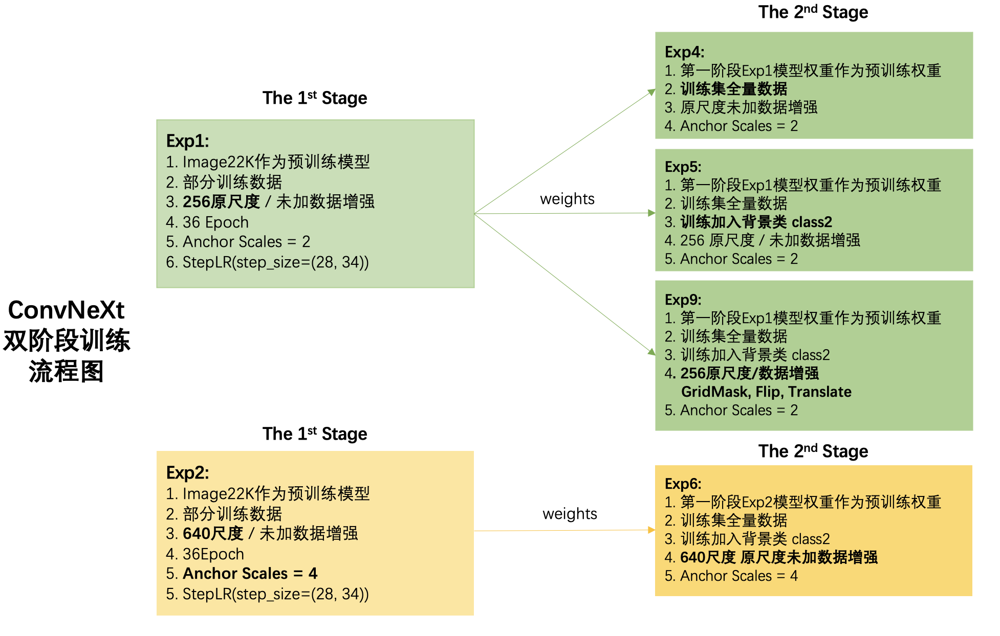
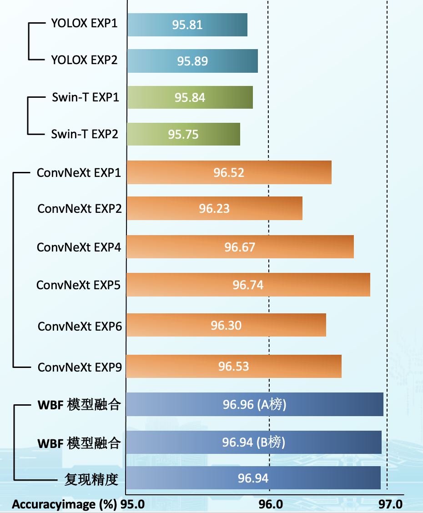

# DCIC 2022 海上船舶智能检测 — 深度炼丹


<div align=center></div>

<p align="center">团队：深度炼丹</p>

## 一. 算法解决方案

### 1.1 解决方案

- 预处理
  - 形态学闭操作处理图片：增强小目标船只
- 数据增强
  - Mosaic，MixUp （只在YOLOX中work）
  - GridMask，Flip，Translate
  
- 模型架构
  - ConvNext
  - Swin-T
  - YoloX

- 模型融合
  - WBF融合多次结果


### 1.2 创新性

- anchor适应赛题数据

  - 根据训练集给出的目标label，统计目标长短边比例，目标大小
  - 根据统计数据更改anchor ratio 和 anchor scale以适应小目标与船只目标大小

- cascade iou阈值适应赛题map要求

  - cascade 每个head的预测bbox结果在其对应iou阈值的AP上效果最好
  - 根据比赛0.5的iou要求, 将cas三个head的iou阈值调整为0.3, 0.4, 0.5

- 加入背景类

  - 由于SAR图像背景多样性，船只靠岸时，船只离岸在海面时，船只目标容易与背景混淆，因此引入背景类
  - 在目标的周围生成与目标相同大小的背景类，将此类作为新类别加入到模型训练中，使得模型不仅学习到船只特征，对于背景场景也有一定的先验知识。在测试阶段，我们只需要关注船只类别的识别结果即可

- ConvNext双阶段训练

  <div align=center></div>

  

- 模型集成

  - 使用WBF对三个模型的检测结果ensemble
  - 模型权重采用逐级递增策略，Yolox，Swin-T，ConvNext从1开始递增 weights = [1, 2, 3, 4 ...]
  - WBF选取max模式，iou_thred = 0.5

### 1.3 其他尝试

其他尝试，但不work：

- anchor设置为8尺寸

- focal loss + GIoU

- mixup+mosaic （只有YoloX中work）

- box head的回归loss替换为giou loss, 替换为iou loss

- SWA

- global context block

- 多尺度训练（只有YoloX中work）

- Grid Mask


## 二. 启动docker容器

为达到主办方复线要求，我们把运行环境打包成镜像方便主办方运行

### 2.1 镜像说明

**该镜像内只包含运行环境**

1. 克隆仓库：`git clone https://gitee.com/PHP_Go_c51e/DCIC2022_ShipDetection-DeepAlchemy.git `

1. 下载数据：从该链接[百度云:3xtp](https://pan.baidu.com/s/1sc9DPg-N6y3Uv7iQoMy_9w)内的数据文件夹内下载数据，解压后放置到`/data/user_data`文件路径下，此时`/data/user_data`应该包含数据文件：`dcic_coco_dataset/dcic_coco_2cls_dataset/ dcic_denoise_2cls_dataset/dcic_full_coco_2cls_dataset/dcic_full_coco_dataset` ，具体数据说明请查看下文 《**5.2 数据说明**》

   注意：`/data/user_data`中已存在这些空文件夹直接覆盖即可

2. 下载预训练模型：按照下文《**六. 预训练模型下载**》中的链接，下载预训练模型。下载后分别放置到指定文件夹下，**ConvNeXt和Swin-Transformer预训练模型放置在`/data/code/mmdet/pretrained/`文件夹下，YOLOX预训练模型放置在`/data/code/yolox/pretrained/`文件夹下**

### 2.2 运行指令
进入git仓库代码所在目录*/DCIC2022_ShipDetection-DeepAlchemy下(该目录下包含Dockerfile)
```shell
docker build -t da . (根据Dockerfile构建容器)
nvidia-docker run --shm-size=8G -v /data:/data -it da:latest sh run.sh （启动容器 一键训练+推理）
```

Tips : 请指明共享内存--shm-size=8G

### 2.3 data目录层级结构

```shell
|-- data
    |-- raw_data
        |-- (原生数据)
	|-- user_data
	    |-- dcic_coco_dataset
	    |-- dcic_coco_2cls_dataset
	    |-- dcic_denoise_2cls_dataset
	    |-- dcic_full_coco_dataset
	    |-- dcic_full_coco_2cls_dataset
    |-- code
        |-- mmdet
        |-- yolox
        |-- utils
    |-- prediction_result
	    |-- result.csv
    |--README.md
```

## 三. 代码环境及依赖

- OS：CentOS Linux release 7.8.2003 (Core)
- 内核版本：Linux version 3.10.0-1127.19.1.el7.x86_64 (mockbuild@kbuilder.bsys.centos.org) (gcc version 4.8.5 20150623 (Red Hat 4.8.5-39) (GCC) )
- GPU：Tesla V100-SXM2 32GB * 8
- Python：python3.7
- Nvidia依赖：
  - cuda：10.2 / 11.3
  - cudnn：7.6.5 / 8.2.0
- DL框架：
  - torch 1.10.2
  - torchvision: 0.11.3
- Detection框架：
  - Openmmlab - mmdetection
  - mmvc-full：1.4.0
  - mmdet：2.11.0
- 混合精度训练框架:
  - apex: 0.1
- Docker:
  - Cuda: 11.3
  - Cudnn: 8.2.0
  - Torch: 1.10
  - python: 3.7
  - mmcv_full: 1.4.0
  

**详细requirements请查看`openmmlab_ens.yaml` 和 `yolox_ens.yaml`**

## 四. 依赖安装及编译

如不需要docker运行，则可以手动安装和编译运行环境，具体操作如下：

### openmmlab环境：

1. 创建虚拟环境： `conda create -n openmmlab python=3.7` 并激活`conda activate openmmlab`

2. 安装pytorch：`conda install pytorch torchvision torchaudio cudatoolkit=10.2 -c pytorch`

3. 安装其他依赖：`pip install -r openmmlab_ens.txt`

4. 安装 `mmcv-full(1.4.0)` ：按照mmdetection官方说明安装(需要对应cuda及torch版本)

   https://github.com/open-mmlab/mmdetection/blob/731a28ee7b73452a859d507c99185d1c0d238cb8/docs/get_started.md

5. 编译`mmdetection`：

	```shell
   cd 到代码目录下
   pip install -r requirements/build.txt
   pip install -v -e .
	```

### yolox环境：

1. 创建虚拟环境： `conda create -n yolox python=3.7` 并激活`conda activate yolox`

2. 安装pytorch：`conda install pytorch torchvision torchaudio cudatoolkit=11.3 -c pytorch`

3. 安装其他依赖：`pip install -r yolox_ens.txt`

4. 编译`yolox`：

   ```shell
   cd 到yolox代码目录下
   pip install -r requirements/build.txt
   pip install -v -e .
	```
## 五.数据准备

### 5.1 COCO格式

1. `training_dataset`分割成训练集与验证集：取`training_dataset`中`39223.jpg` 到最后`39612.jpg`，一共220张图片和labels当作验证集，剩余21284张图片和labels当作训练集

2. 制作COCO格式数据集

   1. 新建train，val和test文件夹，并将分割好的训练集放到train文件夹中，验证集放到val文件夹中，测试集放到test文件夹中。

   2. 通过**xx中**的`path_replacer.py`生成train.txt, val.txt和test.txt：

      1. train.txt: 

         ```shell
         python path_replacer.py --path_image_folder /train文件夹路径/ --path_txt /生成train.txt的存放路径(路径最后记得加/train.txt)/
         
         例如：python path_replacer.py --path_image_folder/data/home/scv1442/run/DCIC_2022_Swin-Transformer/data/dcic_coco_dataset/train --path_txt /data/home/scv1442/run/DCIC_2022_Swin-Transformer/data/dcic_coco_dataset/train.txt
			```

      2. val.txt与test.txt生成方式与上述相同

   3. 通过`main.py`生成COCO格式的annotations：
   
      1. 生成`train.json`: 
      
         ```shell
         python main.py --path /train.txt存放路径/ --output /生成json文件的名称(注意生成的json在output文件夹下)/
         
         例如：python main.py --path /data/home/scv1442/run/DCIC_2022_Swin-Transformer/data/dcic_coco_dataset/train.txt --output train.json
			```

      2. 生成`val.json`和`test.json`：与上述相同

   4. `train.json`,`val.json`和`test.json`放置到annotations文件中
   
3. 数据层级结构：

   ```shell
   dcic_coco_dataset/
   	annotations/
   		train.json
   		val.json
   		test.json
   	train/
   		00001.jpg
   		00001.txt
   		...
   	val/
   		00002.jpg
   		00002.txt
   		...
   	test/
   		00003.jpg
   		...
   	train.txt
   	val.txt
   	test.txt
	```

4. **可直接下载制作好的COCO数据集** 地址：[百度云code:3xtp](https://pan.baidu.com/s/1sc9DPg-N6y3Uv7iQoMy_9w) 

### 5.2 数据说明

1. dcic_coco_dataset：原始数据集转换成COCO格式，并取最后训练集220张作为验证集
2. dcic_full_coco_dataset：原始数据集换成COCO格式，全量训练集用于训练
3. dcic_coco_2cls_dataset：原始数据集加入背景类转换成COCO格式，并取最后训练集220张作为验证集
4. dcic_denoise_2cls_dataset：原始数据集经过形态学闭操作预处理后加入背景类转换成COCO格式，并取最后训练集220张作为验证集
5. dcic_full_coco_2cls_dataset：原始数据集加入背景类转换成COCO格式，全量训练集用于训练

## 六. 预训练模型下载

ConvNeXt 预训练模型：

- cascade_mask_rcnn_convnext_xlarge_22k_3x.pth：https://dl.fbaipublicfiles.com/convnext/coco/cascade_mask_rcnn_convnext_xlarge_22k_3x.pth
- **官方下载页面**：https://github.com/facebookresearch/ConvNeXt/tree/main/object_detection

Swin-Transformer 预训练模型：

- swin_large_patch4_window7_224_22k.pth：https://github.com/SwinTransformer/storage/releases/download/v1.0.0/swin_large_patch4_window7_224_22k.pth
- swin_small_patch4_window7_224.pth:https://github.com/SwinTransformer/storage/releases/download/v1.0.0/swin_small_patch4_window7_224.pth
- **官方下载页面**：https://github.com/SwinTransformer/storage/releases

YoloX 预训练模型：

- yolox_x.pth: https://github.com/Megvii-BaseDetection/YOLOX/releases/download/0.1.1rc0/yolox_x.pth
- **官方下载页面**：https://github.com/Megvii-BaseDetection/YOLOX/releases

**下载后分别放置到`./mmdet/pretrained`和`./yolox/pretrained`文件夹下即可**

## 七. 模型训练

### ConvNeXt系列

- **Exp1**：原版ConvNeXt / 配置文件：cascade_convnext_x_exp1.py

  ```python
  ./tools/dist_train.sh ./configs/convnext/cascade_convnext_x_exp1.py 8 (这里我们使用了8卡)
  
  训练后的log和权重文件都保存在./work_dirs/cascade_convnext_x_exp1 目录下
	```

- **Exp2**：640尺度训练原版ConvNeXt / 配置文件：cascade_convnext_x_1cls_640_exp2.py 

  ```python
  ./tools/dist_train.sh ./configs/convnext/cascade_convnext_x_1cls_640_exp2.py 8
  
  训练后的log和权重文件都保存在./work_dirs/cascade_convnext_x_1cls_640_exp2 目录下
  ```

- **Exp4**: Exp1为预训练权重训练全量数据 / 配置文件：cascade_convnext_x_1cls_full_exp4.py

  ```python 
  ./tools/dist_train.sh ./configs/convnext/cascade_convnext_x_1cls_full_exp4.py 8
  
  训练后的log和权重文件都保存在./work_dirs/cascade_convnext_x_1cls_full_exp4 目录下
  ```

- **Exp5:** Exp1为预训练权重训练2class的全量数据 / 配置文件：cascade_convnext_x_2cls_full_exp5

  ```python
  ./tools/dist_train.sh ./configs/convnext/cascade_convnext_x_2cls_full_exp5.py 8
  
  训练后的log和权重文件都保存在./work_dirs/cascade_convnext_x_2cls_full_exp5 目录下
  ```

- **Exp6:** Exp2为预训练权重训练2class的640尺度全量数据 / 配置文件：cascade_convnext_x_2cls_full_640_exp6.py

  ```python
  ./tools/dist_train.sh ./configs/convnext/cascade_convnext_x_2cls_full_640_exp6.py 8
  
  训练后的log和权重文件都保存在./work_dirs/cascade_convnext_x_2cls_full_640_exp6 目录下
  ```

- **Exp9:** Exp1为预训练权重训练2class 256尺度经过数据增强的数据 配置文件：cascade_convnext_x_2cls_full_aug_256_exp9.py

  ```shell
  ./tools/dist_train.sh ./configs/convnext/cascade_convnext_x_2cls_full_aug_256_exp9.py 8
  
  训练后的log和权重文件都保存在./work_dirs/cascade_convnext_x_2cls_full_aug_256_exp9 目录下
  ```

### Swin-Transformer 系列

- **Exp1:** 2class 256尺度数据增强 / 配置文件：swin_large_2cls_full_exp1.py

  ```python
  ./tools/dist_train.sh ./configs/convnext/swin_large_2cls_full_exp1.py 8
  
  训练后的log和权重文件都保存在./work_dirs/swin_large_2cls_full_exp1 目录下
  ```

- **Exp2:** 以Exp1权重为预训练模型 继续训练18epoch / 配置文件：swin_large_continue_exp2.py

  ```python
  ./tools/dist_train.sh ./configs/convnext/swin_large_continue_exp2.py 8
  
  训练后的log和权重文件都保存在./work_dirs/swin_large_continue_exp2 目录下
  ```

### YOLOX 系列

- **Exp1**: 2class训练yolox-x模型230个epoch

  ```python
  python tools/train.py --experiment-name yolox_x_2cls_230epoch -f exps/yolox_x.py --devices 8 --batch-size 64 -o --ckpt pretrained/yolox_x.pth
  ```

- **Exp2**: 2class训练降噪数据130个epoch

  ```python
  python tools/train.py --experiment-name yolox_x_2cls_denoise_130epoch -f exps/yolox_x.py --devices 4 --batch-size 32 -o --ckpt pretrained/yolox_x.pth
  ```

### 线上成绩/训练Log及模型权重：

**为帮助主办方复现，我们提供了所有的训练log以及模型权重：**

| ConvNext | 线上得分 | 配置文件                                                     | 训练log                                                      | 模型权重                                                     |
| -------- | -------- | ------------------------------------------------------------ | ------------------------------------------------------------ | ------------------------------------------------------------ |
| Exp1     | 0.9652   | [Exp1](./data/code/mmdet/configs/convnext/cascade_convnext_x_exp1.py) | [convnext_exp1.log](assets/train_logs/convnext_exp1.log)     | [百度云:3xtp](https://pan.baidu.com/s/1sc9DPg-N6y3Uv7iQoMy_9w) |
| Exp2     | 0.9623   | [Exp2](data/code/mmdet/configs/convnext/cascade_convnext_x_1cls_640_exp2.py) | [convnext_exp2.log](assets/train_logs/convnext_exp2.log)     | [百度云:3xtp](https://pan.baidu.com/s/1sc9DPg-N6y3Uv7iQoMy_9w) |
| Exp4     | 0.9667   | [Exp4](/data/code/mmdet/configs/convnext/cascade_convnext_x_1cls_full_exp4.py) | [convnext_exp4.log](assets/train_logs/convnext_exp4.log)     | [百度云:3xtp](https://pan.baidu.com/s/1sc9DPg-N6y3Uv7iQoMy_9w) |
| Exp5     | 0.9674   | [Exp5](/data/code/mmdet/configs/convnext/cascade_convnext_x_2cls_full_exp5.py) | [convnext_exp5.log](assets/train_logs/convnext_exp5.log)     | [百度云:3xtp](https://pan.baidu.com/s/1sc9DPg-N6y3Uv7iQoMy_9w) |
| Exp6     | 0.9630   | [Exp6](data/code/mmdet/configs/convnext/cascade_convnext_x_2cls_full_640_exp6.py) | [convnext_exp6.log](assets/train_logs/convnext_exp6.log)     | [百度云:3xtp](https://pan.baidu.com/s/1sc9DPg-N6y3Uv7iQoMy_9w) |
| Exp9     | 0.9653   | [Exp9](data/code/mmdet/configs/convnext/cascade_convnext_x_2cls_full_aug_256_exp9.py) | [convnext_exp9(1).log](assets/train_logs/convnext_exp9(1).log) / [convnext_exp9(2).log](assets/train_logs/convnext_exp9(2).log) | [百度云:3xtp](https://pan.baidu.com/s/1sc9DPg-N6y3Uv7iQoMy_9w) |

| Swin-Transformer | 线上得分 | 配置文件                                                     | 训练log                                          | 模型权重                                                     |
| ---------------- | -------- | ------------------------------------------------------------ | ------------------------------------------------ | ------------------------------------------------------------ |
| Exp1             | 0.9584   | [Exp1](data/code/mmdet/configs/swin/swin_large_2cls_full_exp1.py) | [swin_exp1.log](assets/train_logs/swin_exp1.log) | [百度云:3xtp](https://pan.baidu.com/s/1sc9DPg-N6y3Uv7iQoMy_9w) |
| Exp2             | 0.9575   | [Exp2](data/code/mmdet/configs/swin/swin_large_continue_exp2.py) | [swin_exp2.log](assets/train_logs/swin_exp2.log) | [百度云:3xtp](https://pan.baidu.com/s/1sc9DPg-N6y3Uv7iQoMy_9w) |

| YoloX | 线上得分 | 配置文件                                      | 训练log                                            | 模型权重                                                     |
| ----- | -------- | --------------------------------------------- | -------------------------------------------------- | ------------------------------------------------------------ |
| Exp1  | 0.9581   | [Exp1](/data/code/yolox/exps/yolox_x_exp1.py) | [yolox_exp1.txt](assets/train_logs/yolox_exp1.txt) | [百度云:3xtp](https://pan.baidu.com/s/1sc9DPg-N6y3Uv7iQoMy_9w) |
| Exp2  | 0.9589   | [Exp2](/data/code/yolox/exps/yolox_x_exp2.py) | [yolox_exp2.txt](assets/train_logs/yolox_exp2.txt) | [百度云:3xtp](https://pan.baidu.com/s/1sc9DPg-N6y3Uv7iQoMy_9w) |

<div align=center></div>

## 八. 推理测试

### ConvNeXt和Swin-Transformer系列

```python
./tools/dist_test.sh ./配置文件路径/ /模型参数路径/ 8 --format-only --options "jsonfile_prefix=./json名称"

例如：
./tools/dist_test.sh ./configs/swin/swin_large.py /data/home/scv1442/run/DCIC_2022_Swin-Transformer/work_dirs/swin_large_18epoch/latest.pth 8 --format-only --options "jsonfile_prefix=./swin_large_18epoch"
```

### YOLOX系列

```python
python tools/demo.py image -expn 文件生成路径 -f exps/yolox_x.py -c /模型参数路径/ --path /测试数据路径/ --conf 0.5 --nms 0.65 --tsize 640 --save_result --device gpu

例如：
python tools/demo.py image -expn yolox_x_2cls_230epoch -f exps/yolox_x.py -c /data/home/scv1442/run/DCIC2022_YOLOX/YOLOX_outputs/yolox_x_2cls_230epoch/last_epoch_ckpt.pth --path /data/home/scv1442/run/DCIC2022/DCIC2022_dataset/images/test --conf 0.5 --nms 0.65 --tsize 640 --save_result --device gpu
```

## 九. 模型融合

使用WBF对三个模型的检测结果ensemble

- 模型权重采用逐级递增策略，Yolox，Swin-T，ConvNext从1开始递增 weights = [1, 2, 3, 4 ...]
- WBF选取max模式，iou_thred = 0.5

 `data/code/utils/wbf_test.py `

## 十. 提交格式转换

`data/code/utils/post_process.py `

## 十一. 联系

1602288964@qq.com
